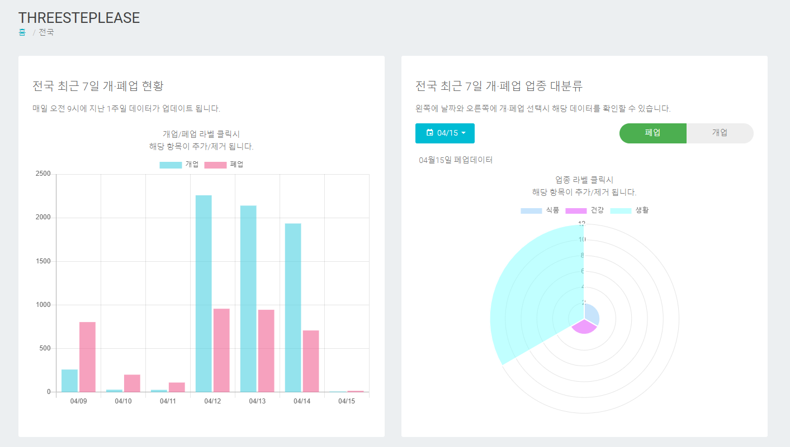
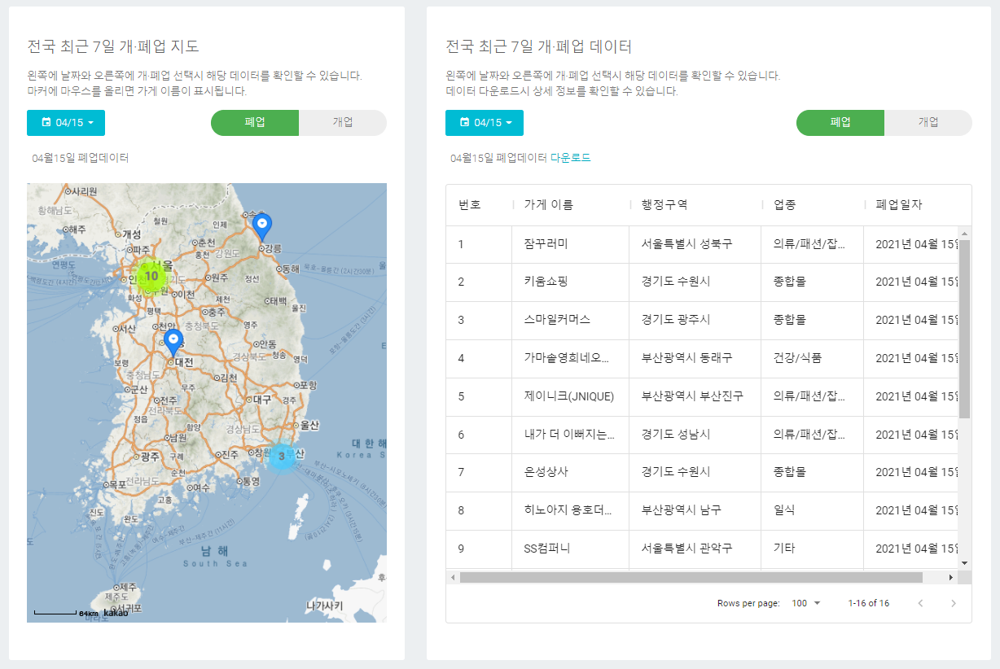
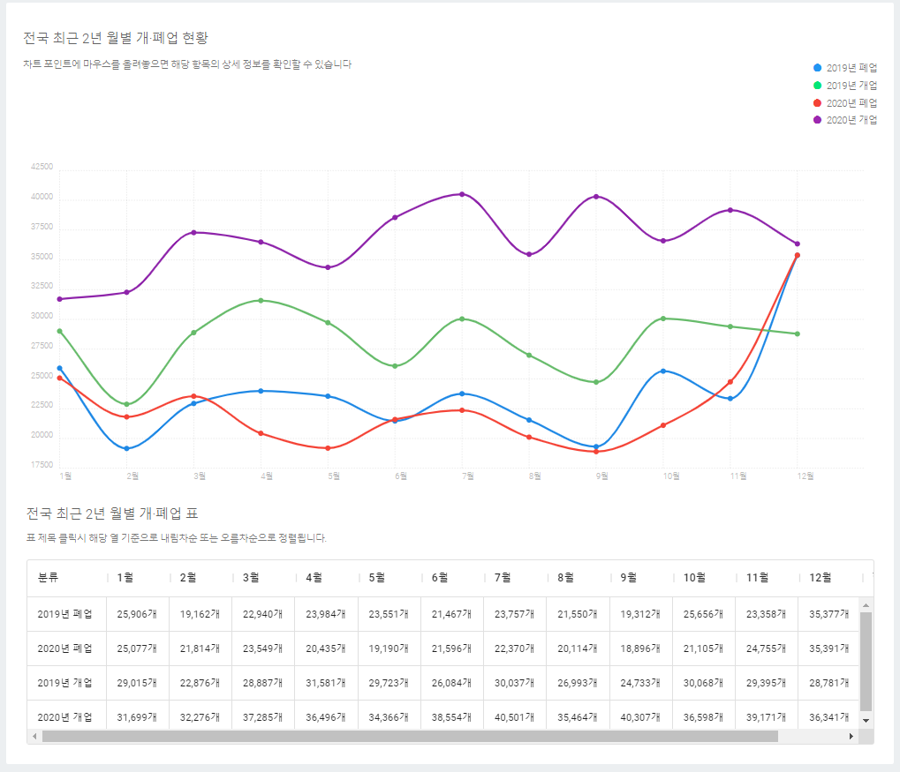
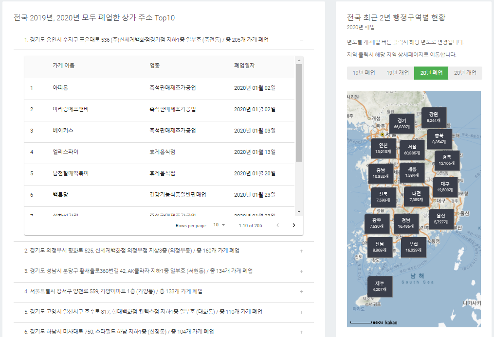
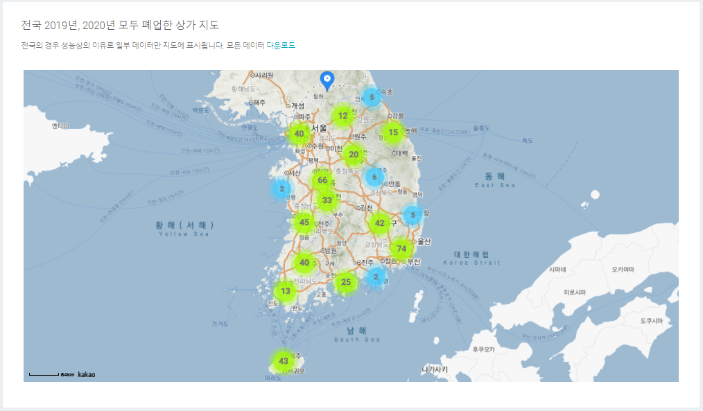

# THREESTEPLEASE

## 사이트 주소

<http://52.79.102.189:8080>

### 사용방법

1. 행정구역 클릭시 해당 페이지로 이동합니다.<br/>정보 클릭시 해당 View로 스크롤이 이동합니다.<br/>왼쪽 상단에 메뉴 아이콘 클릭시 메뉴바가 나왔다가 사라졌다가 합니다.<br/>오른쪽 상단의 종 모양은 공지사항입니다.<br/>종모양 왼쪽에 전체화면 아이콘은 웹에서 작동하는 전체화면, 전체화면 해제 버튼입니다.

   

2. 차트 라벨 클릭시 해당 항목이 추가/제거 되며, 차트에 마우스를 올리면 상세 정보 확인이 가능합니다.<br/> 업종 대분류의 경우 날짜와 개·폐업 선택시 해당 데이터를 확인할 수 있습니다.

   

3. 업종 대분류의 경우 날짜와 개·폐업 선택시 해당 데이터를 확인할 수 있습니다.<br/>지도의 경우 마커에 마우스를 올리면 해당 마커의 가게 이름이 표시되고, 주소로 마커를 찍기때문에 주소가 정확하지 않거나 데이터가 너무 많을경우 일부 데이터만 마커로 표시될 수 있습니다.<br/>테이블의 경우 표시될 데이터 갯수를 선택할 수 있으며, 테이블 헤더에 각 항목 클릭시 오름차순/내림차순으로 정렬이 가능하고, 헤더 각 항목 오른쪽 메뉴 버튼 클릭시 항목을 추가/제거 할 수 있습니다.<br/>데이터 테이블 상단에 다운로드 링크 클릭시 해당 데이터가 CSV 파일로 다운로드됩니다.

   

4. 차트 포인트에 마우스를 올리면 상세 정보 확인이 가능합니다.<br/>테이블은 정렬이 가능합니다.<br/>최근 2년 데이터의 경우 약 820만건의 데이터를 가공하여 제작하였습니다.

   

5. 왼쪽 카드의 경우 주소 클릭시 해당 항목이 나타났다가 사라졌다가 합니다.<br/>오른쪽 지도의경우 년도 선택시 해당 년도 정보를 확인할 수 있으며, 각 지역 클릭시 해당 지역 상세페이지로 이동합니다.

   

6. 최근 2년간 모두 폐업 이력이 있는 상가 지도입니다.<br/>다운로드 링크 클릭시 해당 데이터가 CSV 파일로 다운로드됩니다.

   

### 문서 구조

```sh
├─api (Server)
│  │  urls.py  <-- api url
│  └─ views.py <-- api view
│
│
└─frontend
  ├─static
  │    각종 정적인 파일들
  │
  ├─templates/frontend
  │    index.html
  │
  └─src
    │ App.js
    │ index.js
    ├───components
    │     ├─Chart
    │     │     ChartistMonth.js       <-- 전국 최근 2년 월별 차트
    │     │     CityMonthLineChart.js  <-- 행정구역 2년 월별 차트
    │     │     HorizontalBarChart.js  <-- 최근 2년 업종 대분류 바차트
    │     │     PieChart.js            <-- 최근 2년 업종 중분류 차트
    │     │     RadarCahrt.js          <-- 최근 2년 업종 중분류 레이더차트
    │     │     RealTimeBarChart.js    <-- 실시간데이터 갯수 차트
    │     │     RealTimePolarChart.js  <-- 실시간데이터 업종 대분류 차트
    │     │
    │     ├─Csv
    │     │     RealTimeDownLoadCsv.js     <-- 실시간데이터 CSV파일 다운로드
    │     │     SameAddressDownLoadCsv.js  <-- 같은주소 데이터 CSV파일 다운로드
    │     │
    │     ├─Loading
    │     │     PageLoading.js         <-- 전체 페이지 로딩
    │     │     RoudCircleLoading.js   <-- 로딩 느린 View 로딩
    │     │
    │     ├─Map
    │     │     CityMap.js             <-- 최근 2년 행정구역별 현황 지도
    │     │     RealTimeCityMap.js     <-- 실시간데이터 지도
    │     │     SameAddressMap.js      <-- 최근 2년 같은주소 지도
    │     │
    │     ├─Modal
    │     │     Modal.js               <-- 공지사항
    │     │
    │     ├─Navigation
    │     │     DropDownMenu.js        <-- Drop down 메뉴
    │     │     MainNavbar.js          <-- 상단바
    │     │     PageFooter.js          <-- 푸터
    │     │     PageHeader.js          <-- 페이지 헤더
    │     │
    │     ├─ScrollToTop
    │     │     ScrollToTop.js         <-- 페이지 전환시 스크롤 Top
    │     │
    │     ├─Tab
    │     │     CategoryTabs.js        <-- 최근 2년 업종 대분류 차트 전환 탭
    │     │     TabsAccording.js       <-- 최근 2년 같은주소 Top10 탭
    │     │     TypeDetailTabs.js      <-- 최근 2년 업종 중분류 업종 전환 탭
    │     │
    │     ├─Table
    │     │     CustomNoRowsOverlay.js <-- 데이터 없을시 보여주는 View
    │     │     FixedHeaderTable.js    <-- 최근 2년 같은주소 Top10 테이블
    │     │     MonthTable.js          <-- 최근 2년 월별 테이블
    │     │     RealTimeCategoryEmpty.js  <-- 실시간데이터 업종 대분류 데이터 없을시
    │     │     RealTimeTable.js       <-- 실시간데이터 테이블
    │     │
    │     └─View
    │           CategoryView.js         <-- 최근 2년 업종 대분류 View
    │           CityMonthView.js        <-- 행정구역 최근 2년 월별 View
    │           MainCityMapView.js      <-- 최근 2년 행정구역별 현황 View
    │           MainMonthView.js        <-- 전국 최근 2년 행정구역별 현황 View
    │           RealTimeCategoryView.js <-- 실시간데이터 업종 대분류 View
    │           RealTimeCityMapView.js  <-- 실시간데이터 지도 View
    │           RealTimeTableView.js    <-- 실시간데이터 테이블 View
    │           RealTimeTotalView.js    <-- 실시간데이터 전체 현황 View
    │           RealTimeView.js         <-- 실시간데이터 View
    │           SameAddressView.js      <-- 최근 2년 같은주소 View
    │           TypeDetailView.js       <-- 최근 2년 업종 중분류 View
    │
    └─pages
        CityPage.js  <-- 행정구역 상세페이지
        HomePage.js  <-- 메인페이지 (전국 현황)

```

<br/>

## Front-end

- React.js

## Back-end

- Django
- MongoDB

## 데이터 출처

- 지방행정 인허가데이터
- <https://www.localdata.go.kr>

## 안드로이드 앱

- <https://github.com/dkstjdwns114/three_step_lease_cordova>

## 실시간데이터 파싱 코드

- <https://github.com/dkstjdwns114/three_step_real_time>

<br/>

### 만들게된 계기

<br/>
최근 COVID-19로 인해 폐업한 상가가 많아 뉴스에 세발짝 걸어가면 상가 임대가 하나 있다고 해서 '삼보임대'라는 말이 나왔습니다. 실제로 저도 길을 가다보면 임대 내놓은 상가가 많이 보이길래 2019년 대비 2020년에는 얼마나 많은 상가들이 폐업했을지, 개업 대비 폐업이 얼마나 많은지 알아보고싶어서 이 프로그램을 만들게 되었습니다. 그런데 만들고 보니 오히려 2019년이 폐업과 개업 갯수는 적었지만 흥미로운점은 2020년 말에 폐업 그래프는 일정하게 증가하는 사실을 알게 되었습니다. 개업, 폐업 그래프는 일정하게 나올 수가 없지만 전국 최근 2년 월별차트를 보면 2020년 9월부터 12월까지 폐업한 상가 수가 일정하게 증가하는 사실을 알 수 있습니다. 실시간 데이터는 매일 변동되는 데이터를 확인할 수 있고, 이렇게 매일 수집해 놓은 데이터를 가지고 2022년에는 더 수월하게 2020년과 2021년 데이터를 비교할 수 있기 때문에 실시간 데이터를 제공하게 되었습니다.
